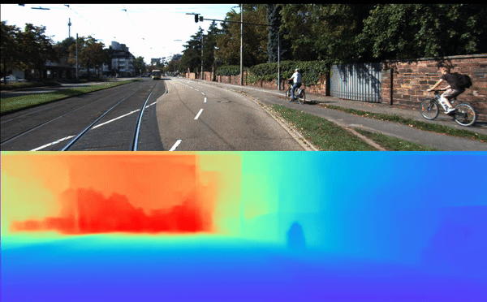
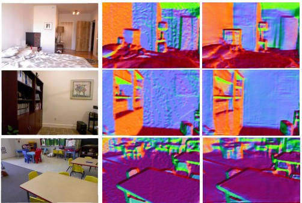
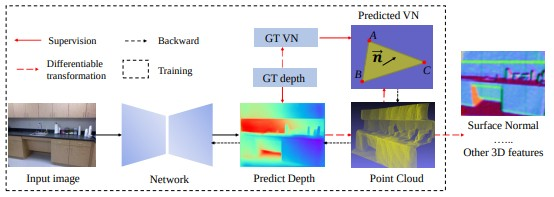
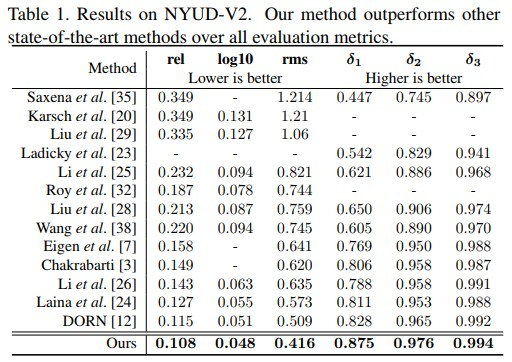
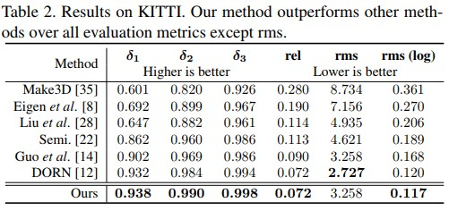

#### Enforcing geometric constraints of virtual normal for depth prediction.

[NEW] Training codes have been uploaded!


This repository contains the source code of our paper:
[Yin Wei, Yifan Liu, Chunhua Shen, Youliang Yan, Enforcing geometric constraints of virtual normal for depth prediction](https://arxiv.org/abs/1907.12209) (accepted for publication in ICCV' 2019).

## Some Results






## Framework

****
## Hightlights
- **State-of-the-art performance:** The comparisons with other SOTA methods on NYU and KITTI are illustrated as follow. The published model trained on NYU can achieve 10.5% on absrel.




****
## Installation
- Please refer to [Installation](./Installation.md).

## Datasets
- NYUDV2
   The details of datasets can be found [here](https://cs.nyu.edu/~silberman/datasets/nyu_depth_v2.html). The Eigen split of labeled images can be downloaded [here](https://cloudstor.aarnet.edu.au/plus/s/G2ckXCJX3pvrzRU). Please extract it to ./datasets. Our SOTA model is trained on the around 20K unlabled images.
    
- KITTI
  The details of KITTI benchmark for monocular depth prediction is [here](http://www.cvlibs.net/datasets/kitti/eval_depth.php?benchmark=depth_prediction). We use both the official split and Eigen split. You can find the filenames [here](https://github.com/mrharicot/monodepth/tree/master/utils/filenames).
  
  
## Model Zoo
- ResNext101_32x4d backbone, trained on NYU dataset, download [here](https://cloudstor.aarnet.edu.au/plus/s/7kdsKYchLdTi53p)
- ResNext101_32x4d backbone, trained on KITTI dataset (Eigen split), download [here](https://cloudstor.aarnet.edu.au/plus/s/eviO16z68cKbip5)
- ResNext101_32x4d backbone, trained on KITTI dataset (Official split), download [here](https://cloudstor.aarnet.edu.au/plus/s/pqIxORtFrVOFoea)
- ImageNet pretrained weight, download [here](https://cloudstor.aarnet.edu.au/plus/s/J87DYsTlOjD83LR). 


  
## Inference

```bash
# Run the inferece on NYUDV2 dataset
 python  ./tools/test_nyu_metric.py \
		--dataroot    ./datasets/NYUDV2 \
		--dataset     nyudv2 \
		--cfg_file     lib/configs/resnext101_32x4d_nyudv2_class \
		--load_ckpt   ./nyu_rawdata.pth 
		
# Test depth predictions on any images, please replace the data dir in test_any_images.py
 python  ./tools/test_any_images.py \
		--dataroot    ./ \
		--dataset     any \
		--cfg_file     lib/configs/resnext101_32x4d_nyudv2_class \
		--load_ckpt   ./nyu_rawdata.pth 
```
If you want to test the kitti dataset, please see [here](./datasets/KITTI/README.md)


## Training

```bash
# Run the inferece on NYUDV2 dataset
 python  ./tools/train_nyu_metric.py \
		--dataroot    ./datasets/NYUDV2 \
		--dataset     nyudv2 \
		--cfg_file     lib/configs/resnext101_32x4d_nyudv2_class 
                #--load_ckpt *.pth
                #--resume		
```	

### Citation

```
@inproceedings{Yin2019enforcing,
  title={Enforcing geometric constraints of virtual normal for depth prediction},
  author={Yin, Wei and Liu, Yifan and Shen, Chunhua and Yan, Youliang},
  booktitle= {The IEEE International Conference on Computer Vision (ICCV)},
  year={2019}
}

@article{yin2021virtual,
  title={Virtual Normal: Enforcing Geometric Constraints for Accurate and Robust Depth Prediction},
  author={Yin, Wei and Liu, Yifan and Shen, Chunhua},
  journal={IEEE Transactions on Pattern Analysis and Machine Intelligence (TPAMI)},
  year={2021}
}
```


## Other works :)
We have done a new work to aim to solve the generalization problem of monocular depth prediction. Please refer to following link. :)
- Paper: DiverseDepth: Affine-invariant Depth Prediction Using Diverse Data
- Code: https://github.com/YvanYin/DiverseDepth


### Contact
Wei Yin: wei.yin@adelaide.edu.au

